# My Personal Dot File

Goal of this repository is to have all my `.dot` files in one central place. For this [`yadm`](https://yadm.io) (Yet Another Dotfile Manager) is used.

## General

use the command `yadm` whenever you would use `git` while dealing with your dotfiles.

## Initial Setup

```mermaid
flowchart TD
    A["Instal yadm"] --> B{"Did it work?"}
    B -->|No| C["Ähm ...?"]
    B -->|Yes| D["yadm clone git@github.com:killermoehre/personal-bash-config.git"] --> E{Did it work?}
    E -->|No| F("Fix it!") --> D
    E -->|Yes| G["yadm git-crypt unlock"] --> H{"Did it work?"}
    H -->|No| I("Fix it!") --> G
    H -->|Yes| J["yadm bootstrap"] --> K{"Did it work?"}
    K -->|No| L("Fix it!") --> J
    K -->|Yes| M("Happy hacking!")
```



## Secrets

Some stuff shouldn't be known to everyone. For this `git-crypt` is used.

### New files with Secrets

In the same directory create a file named `.gitattributes` with the follwoing content

```gitattributes
<filename> filter=git-crypt diff=git-crypt
```

Check this file in together with the file containing the secret. Only after then commit.

You can check with `yadm git-crypt status <filename>` if the file is crypted.
